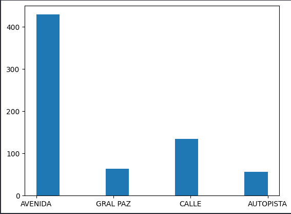
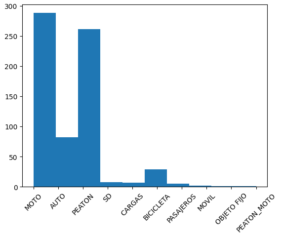
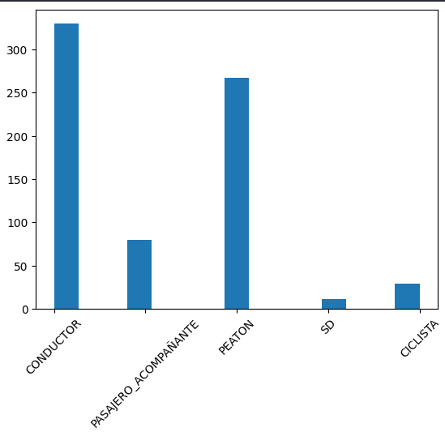
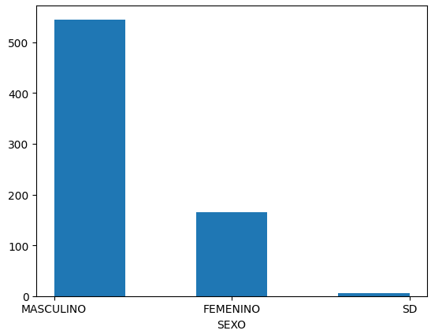

<p align=center><p>

# <h1 align=center> **PROYECTO INDIVIDUAL Nº2** </h1>

# <h1 align=center>**<span style="color:silver">Siniestros viales en la Ciudad de Buenos Aires</span>**</h1>

<p align="center">
  
</p>

### En este segundo proyecto individual, el desafío es encontrar insights referente a la información brindada por el Gobierno de Argentina en cuanto a accidentes viales en la Ciudad de Buenos Aires.
<br>
<div style="text-align: right; color: silver; font-size: 1.2em; font-weight: bold;">
  <a href="https://github.com/DennysDdd/Siniestros_Viales" style="color: silver; text-decoration: none;">
    by Dennys Diaz, Cohorte 13
  </a>
</div>

# <h1 align=center> **Intro** </h1>

Se obtiene información de los años 2016-2021 sobre los *homicidi#s* en la Ciudad de Buenos Aires(CABA), donde se detalla toda la información referente a esos sucesos, tales como ROL, el cual indica que papel desempeñaba la victima, asi también datos como la fecha y hora exacta, cantidad de victimas e incluso ubicación geográfica de los sucesos.

El presente trabajo tiene como finalidad mostrar de manera objetiva los **insights** obtenidos de los datos, apuntando a brindar sugerencias para evitar más trágicos desenlaces en la población de CABA. No es objetivo de este trabajo herir susceptibilidades.

# <h1 align=center> **Análisis de los datos**</h1>

Iniciamos observando la informacion en las hojas presentes en el archivo *homicidios.xlsx*, donde observaremos 4 hojas, de las cuales obtenemos información de los **HECHOS** en la hoja con el mismo nombre; así como información detallada sobre la víctimas del suceso en la hoja **VICTIMA**.

Posterior a la lectura de los datos procedemos a analizar en primer lugar la hoja de **HECHOS**, donde primero observaremos la distribución de los datos alrededor de los años en base al tipo de locación donde ocurrió el suceso. Para este y las consecuentes observaciones usaremos filtros en nuestas hojas ahora tomadas como dataframe en Jupyter Notebook de la siguiente manera:
```
DATAFRAME[DATAFRAME["COLUMNA A OBSERVAR"]]
```
Así obtenemos:

<p align="center">
  
</p>


Ahora veamos la distribución de la hoja de **HECHOS** en relación al medio de trasnporte por el cual se desplazaba la victima, en el cual obtenemos la siguiente gráfica:

<p align="center">
  
</p>

## **QUE INTERESANTE!**

Observamos que la mayor cantidad de víctimas son aquellas que se transportaban mediante **MOTOCICLETA**

Ahora que hemos observado la hoja de HECHOS, veamos que podemos observar en la hoja de **VICTIMAS**

A modo de recordatorio observaremos la información relevante de las columnas de la hoja VICTIMAS de la siguiente manera:
```
VICTIMAS[VICTIMAS["COLUMNA A OBSERVAR"]]
```
### **QUE ROL OCUPABAN LAS PERSONAS QUE PERECIERON EN LOS ACCIDENTES?**

Veamos la distribución:

<p align="center">
  
</p>

 ### **NO SOLO LAS PERSONAS QUE MANEJABAN ALGUN VEHICULOS SON LAS VICTIMAS, OBSERVAMOS QUE MUCHOS DE LOS PEATONES TAMBIÉN FUERON AFECTADOS!**

Veamos otra consideración interesante de esta hoja:

<p align="center">
  
</p>

### **OBSERVAMOS QUE LA MAYOR CANTIDAD DE VICTIMAS SON DEL SEXO MASCULINO**

Hasta ahora hemos solo observado algunas columnas de las múltiples en cada una de las hojas, se ha realizado este análisis pues las columnas mostradas presentan en su totalidad variables de tipo categórica, las cuales facilitan la visualización de la distribución visual de la totalidad de los datos, además que van acorde a los objetivos de preparar la data para visuaiizar los KPI del presente trabajo.

Pero...

### **QUE KPIs VEREMOS?**

1. Reducir la tasa de homicidios con el objetivo de lograr una disminución del **10%**

2. Reducir la cantidad de accidentes mortales de motococicletas en **7%**

3. Reducir la cantidad de accidentes viales en la **COMUNA1** en **20%**